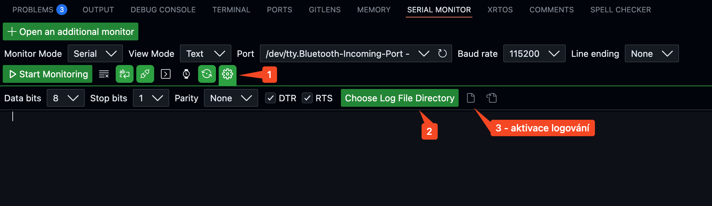

# Postup logování sériových dat

## Konfigurace logování

### Vizuální průvodce


### Kroky aktivace
1. **Výběr portu** (1): Přejít do rozšířeného nastavení sériového monitoru
2. **Adresář log souboru** (2): Kliknout na zelené tlačítko pro výběr složky
3. **Aktivace logování** (3): Zapnout záznam dat

### Příprava dat pro Excel/MATLAB

#### Úprava log souboru
1. Po ukončení záznamu otevřít log soubor
2. Přidat hlavičku CSV (dle vašich dat - pouze příklad):
   ```
   Timestamp,TargetAngle,CurrentAngle,MotorPower
   ```
3. Změnit koncovku souboru na `.csv`

### Doporučený formát dat v programu
Lze využít DIP switch pro přepínání záznamu. Například mezi logováním (csv formát) a formátem pro online zobrazení v grafu ([serial plotter](https://marketplace.visualstudio.com/items?itemName=badlogicgames.serial-plotter) extension pro VS Code).

Formát pro logování (csv formát):
```c
printf("%lu,%.2f,%.2f,%.2f\n", 
    millis(),       // timestamp
    target_angle,   // cílový úhel
    current_angle,  // aktuální úhel
    motor_power     // výkon motoru
);
```

Formát pro online zobrazení grafu:
```c
printf(">target_angle:%.2f,current_angle:%.2f,motor_power:%.2f\r\n", 
    target_angle,   // cílový úhel
    current_angle,  // aktuální úhel
    motor_power     // výkon motoru
);
```

## Tipy
- Kontrolovat správnost záznamu
- Omezit frekvenci logování (cca 30 Hz)
- Před importem zkontrolovat formát dat